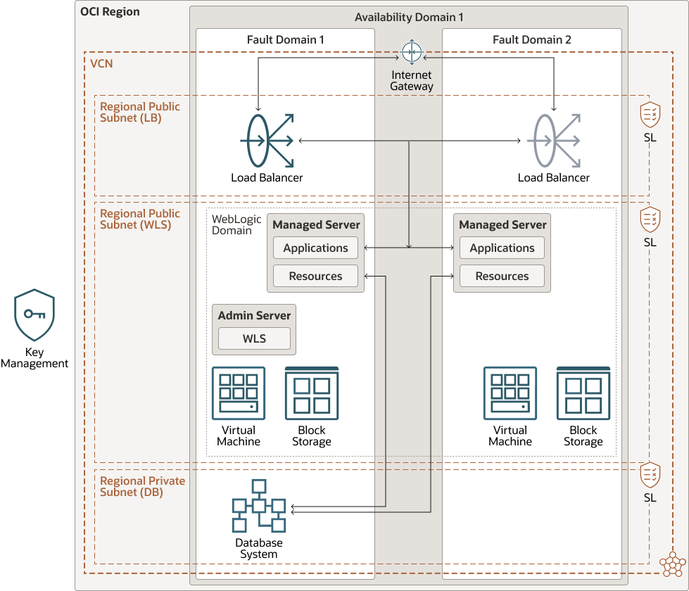

# Oracle WebLogic Server for Oracle Cloud Infrastructure

[Oracle WebLogic Server for Oracle Cloud Infrastructure][wlsoci] allows you to quickly create your Java Enterprise Edition
(Java EE) application environment in [Oracle Cloud Infrastructure (OCI)][oci], including an Oracle WebLogic Server domain,
in a fraction of the time it would normally take on-premises.

Oracle WebLogic Server for OCI is available as a set of applications in the [Oracle Cloud Infrastructure Marketplace][marketplace].
After launching one of these applications, you use a simple wizard interface to configure and provision your domains along
with any supporting cloud resources like compute instances, networks and load balancers.

This Quick Start is an alternative to deploy a Oracle WebLogic Server for OCI stack, that can be used to automate the creation
of WebLogic domains in OCI. You can use the Oracle Cloud Infrastructure [Resource Manager (ORM)][orm] or the Terraform CLI.

For more details on deploying the Oracle WebLogic Server for OCI stack on Oracle Cloud Infrastructure, visit the
"Using Oracle WebLogic Server for OCI" [guide](https://docs.oracle.com/en/cloud/paas/weblogic-cloud/user/index.html).


### Full Topology



The above diagram shows a topology that includes most of the components supported by the Terraform scripts. In this scenario,
the WebLogic servers are in a private subnet. To access the applications running on WebLogic, an OCI load balancer is provisioned
in either public or private regional subnet.  A bastion instance with a public IP address is used to allow access to the VMs
in the private subnet.

To create an Oracle WebLogic Server domain that includes the Java Required Files (JRF) components, you must provide an
existing database in Oracle Cloud Infrastructure. The diagram shows the stack using a database located in a VCN different
from the one use by the WebLogic for OCI stack, with VCN peering. Peering is not necessary if the same VCN is used for both
the stack and the database.

By default, the Oracle WebLogic Server domain is configured to use the local WebLogic Server identity store to maintain
administrators, application users, groups, and roles. These security elements are used to authenticate users, and to also
authorize access to your applications and to tools like the WebLogic Server Administration Console. Oracle WebLogic Server
for OCI can configure a WebLogic domain to use Oracle Identity Cloud Service for authentication. The diagram illustrates
this configuration.

## Before You Begin with Oracle WebLogic Server for OCI

Whether you use Terraform CLI, ORM or the Marketplace to create a stack, you need to perform some pre-requisites. Refer
to the [documentation](https://docs.oracle.com/en/cloud/paas/weblogic-cloud/user/you-begin-oracle-weblogic-cloud.html) for
the pre-requisite steps to using Oracle WebLogic Server for OCI.

For pre-requisites specific to Terraform CLI and ORM, see their corresponding section.

## Using the Marketplace

To create, manage and destroy a WebLogic for OCI stack using the Marketplace, follow the instructions in the
[documentation](https://docs.oracle.com/en/cloud/paas/weblogic-cloud/user/create-stack1.html).

## Using the Terraform command line tool

You need to install the following software in your computer to create a stack using Terraform CLI:
 - [Git](https://git-scm.com/book/en/v2/Getting-Started-Installing-Git)
 - [Terraform](https://www.terraform.io/). The scripts in this Quick Start requires Terraform version >= 1.1.2, < 1.2.0

First, get a local copy of this repo. You can make that with the commands:

```bash
git clone https://github.com/oracle-quickstart/weblogic-server-for-oci.git
cd weblogic-server-for-oci/terraform
ls
```
Example output:

```bash
$ git clone https://github.com/oracle-quickstart/weblogic-server-for-oci.git
Cloning into 'weblogic-server-for-oci'...
remote: Enumerating objects: 2522, done.
remote: Counting objects: 100% (646/646), done.
remote: Compressing objects: 100% (324/324), done.
remote: Total 2522 (delta 449), reused 440 (delta 318), pack-reused 1876
Receiving objects: 100% (2522/2522), 972.92 KiB | 1.54 MiB/s, done.
Resolving deltas: 100% (1735/1735), done.
$ cd weblogic-server-for-oci/terraform
$ ls
autoscaling_variables.tf  data_sources.tf  edition.tf        idcs_variables.tf  locals.tf  modules/         network_variables.tf        oci_images.tf  outputs.tf   schema.yaml        variables.tf  weblogic_variables.tf
bastion_variables.tf      db_variables.tf  fss_variables.tf  inputs/            main.tf    mp_variables.tf  observability_variables.tf  orm/           provider.tf  schema_14110.yaml  versions.tf
$
```

*NOTE*: All the `terraform` commands must be run from the `terraform` directory.

Now, initialize the directory with the module in it. This makes the module aware of the OCI provider. You can do this by
running:

```bash
terraform init
```

Example output:

```bash
$ terraform init
Initializing modules...
- bastion in modules\compute\bastion
- compute in modules\compute\wls_compute
- compute.compute-keygen in modules\compute\keygen
- compute.data-volume in modules\compute\volume
- compute.data_volume_attach in modules\compute\volume
- compute.middleware-volume in modules\compute\volume
- compute.middleware_volume_attach in modules\compute\volume
- compute.wls-instances in modules\compute\instance
- fss in modules\fss
- load-balancer in modules\lb\loadbalancer
- load-balancer-backends in modules\lb\backends
- network-bastion-nsg in modules\network\nsg
- network-bastion-subnet in modules\network\subnet
- network-compute-admin-nsg in modules\network\nsg
- network-compute-managed-nsg in modules\network\nsg
- network-lb-nsg in modules\network\nsg
- network-lb-subnet-1 in modules\network\subnet
- network-mount-target-nsg in modules\network\nsg
- network-mount-target-private-subnet in modules\network\subnet
- network-vcn in modules\network\vcn
- network-vcn-config in modules\network\vcn-config
- network-wls-private-subnet in modules\network\subnet
- network-wls-public-subnet in modules\network\subnet
- observability-autoscaling in modules\observability\autoscaling
- observability-common in modules\observability\common
- observability-logging in modules\observability\logging
- policies in modules\policies
- provisioners in modules\provisioners
- system-tags in modules\resource-tags
- validators in modules\validators
- vcn-peering in modules\network\vcn-peering

Initializing the backend...

Initializing provider plugins...
- Finding hashicorp/null versions matching "~> 3.1.1"...
- Finding oracle/oci versions matching "4.96.0"...
- Finding hashicorp/random versions matching "~> 3.4.3"...
- Finding hashicorp/template versions matching "~> 2.2.0"...
- Finding hashicorp/tls versions matching "~> 4.0.3"...
- Finding hashicorp/time versions matching "~> 0.9.0"...
- Installing hashicorp/template v2.2.0...
- Installed hashicorp/template v2.2.0 (signed by HashiCorp)
- Installing hashicorp/tls v4.0.4...
- Installed hashicorp/tls v4.0.4 (signed by HashiCorp)
- Installing hashicorp/time v0.9.1...
- Installed hashicorp/time v0.9.1 (signed by HashiCorp)
- Installing hashicorp/null v3.1.1...
- Installed hashicorp/null v3.1.1 (signed by HashiCorp)
- Installing oracle/oci v4.96.0...
- Installed oracle/oci v4.96.0 (signed by a HashiCorp partner, key ID 1533A49284137CEB)
- Installing hashicorp/random v3.4.3...
- Installed hashicorp/random v3.4.3 (signed by HashiCorp)

Partner and community providers are signed by their developers.
If you'd like to know more about provider signing, you can read about it here:
https://www.terraform.io/docs/cli/plugins/signing.html

Terraform has created a lock file .terraform.lock.hcl to record the provider
selections it made above. Include this file in your version control repository
so that Terraform can guarantee to make the same selections by default when
you run "terraform init" in the future.

Terraform has been successfully initialized!

You may now begin working with Terraform. Try running "terraform plan" to see
any changes that are required for your infrastructure. All Terraform commands
should now work.

If you ever set or change modules or backend configuration for Terraform,
rerun this command to reinitialize your working directory. If you forget, other
commands will detect it and remind you to do so if necessary.

```

### Configure

First, you need to configure the WebLogic edition, and the license to use when creating the stack. You can select the
[BYOL license](#bring-your-own-license-byol) or the [UCM license](#universal-credits-model-ucm). To configure the edition
and license:
- Copy the file `mp_image_<edition>_<license>.tfvars` from the `terraform/inputs` directory, to the `terraform` directory
- Rename the file to `terraform/mp_image_<edition>_<license>.tfvars` to `terraform/mp_image_<edition>_<license>.auto.tfvars`

For example, if you want to create a WebLogic Enterprise Edition UCM stack, copy the file `terraform/inputs/mp_image_ee_ucm.tfvars`
to `terraform/mp_image_ee_ucm.auto.tfvars`

Next, you need to configure [variables](./VARIABLES.md) to drive the stack creation. This can be done by creating a
`terraform.tfvars` file in the `terraform` directory, using as a base the tfvars files from one of the [solutions](./solutions).

Make sure the plan looks good. Once you created `terraform.tfvars` in the `terraform` directory, just run:

```bash
terraform plan
```

### Deploy

If that's good, you can go ahead and apply to deploy the stack:

```bash
terraform apply
```

You'll need to enter yes when prompted.

After the stack creation is complete, you can
[manage the domain](https://docs.oracle.com/en/cloud/paas/weblogic-cloud/user/manage-domain-oracle-weblogic-cloud.html).

### Destroy the Deployment

When you no longer need the deployment, you can run this command to destroy it:

```bash
terraform destroy
```

You'll need to enter yes when prompted.

**Important:** Refer to [documentation](https://docs.oracle.com/en/cloud/paas/weblogic-cloud/user/delete-domain.html)
for steps to perform before running *terraform destroy*.

## Using OCI Resource Manager

Oracle Cloud Infrastructure [Resource Manager (ORM)][orm] allows you to manage your Terraform configurations and state.
To simplify getting started, the Terraform zip files for use with ORM are created as part of each [release](https://github.com/oracle-quickstart/weblogic-server-for-oci/releases).

If you want to build the zip file to create an ORM stack, you need the following software:

*Linux*

- No additional software is required

*Mac OS*

- GNU sed

*Windows*

- Git bash (included in [Git for Windows](https://gitforwindows.org/)) or any other software that allows you to run bash
  scripts in Windows
- The build scripts use the `zip` command. This is an example of how you can use a program like [7-zip](https://www.7-zip.org/)
  with the build scripts
1. Install 7-zip
2. Locate the file 7z.exe. Copy it to a directory that can be added to your path (e.g. ~/bin)
3. Create a script called `zip` in the same directory (e.g. ~/bin) with the following content:
```bash
#!/bin/bash
7z.exe a $@
```
4. Add the directory where you put the files (e.g. ~/bin) in your PATH
5. Verify zip command is recognized:
```bash
$ zip
 
7-Zip 22.01 (x64) : Copyright (c) 1999-2022 Igor Pavlov : 2022-07-15
 
 
 
Command Line Error:
Cannot find archive name
```

### Create the stack

To build the zip file to create an ORM stack, run the `builds/build_mp_bundles.sh` script.
```bash
$ cd builds/
$ ./build_mp_bundles.sh
Build the Oracle Resource Manager (ORM) bundles to deploy in Marketplace

Arguments: build_mp_bundles.sh -e|--edition <EE|SUITE|SE> -v|--version <12.2.1.4|14.1.1.0> -t|--type <UCM|BYOL> --all
options:
-e, --edition     WebLogic edition. Supported values are EE, SUITE, or SE. Optional when --all option is provided
-v, --version     WebLogic version. Supported values are 12.2.1.4 or 14.1.1.0. Optional when --all option is provided
-t, --type        Type of bundle. Supported values are UCM or BYOL. Optional when --all option is provided
--all             All bundles
```

For example, to create the zip file for a WebLogic 12.2.1.4 Enterprise Edition stack with BYOL license, run the following
command:

```bash
cd builds
./build_mp_bundles.sh --edition EE --version 12.2.1.4 --type BYOL
```

The zip files are generated in the `builds/binaries` directory.

Follow [these steps](https://docs.oracle.com/en-us/iaas/Content/ResourceManager/Tasks/create-stack-local.htm) to create
a ORM stack with a released zip file, or a zip file generated manually.

### Deploy the stack

After you create the stack, you can run a `plan` [job](https://docs.oracle.com/en-us/iaas/Content/ResourceManager/Tasks/create-job-plan.htm)
to validate the resources that will be created.

If the plan looks good, you can run an `apply` [job](https://docs.oracle.com/en-us/iaas/Content/ResourceManager/Tasks/create-job-apply.htm)
to deploy the stack.

After the stack creation is complete, you can
[manage the domain](https://docs.oracle.com/en/cloud/paas/weblogic-cloud/user/manage-domain-oracle-weblogic-cloud.html).

### Destroy the stack

When you no longer need the deployment, you can run a
`destroy` [job](https://docs.oracle.com/en-us/iaas/Content/ResourceManager/Tasks/create-job-destroy.htm) to destroy the stack.

**Important:** Refer to [documentation](https://docs.oracle.com/en/cloud/paas/weblogic-cloud/user/delete-domain.html) for
steps to perform before running a `destroy` job.


## License

These terraform scripts are licensed under the Universal Permissive License 1.0.  See [LICENSE](./LICENSE) for more details.

There are two licensing options available:

### Universal Credits Model (UCM)
The listing in OCI Marketplace can be found here: https://cloudmarketplace.oracle.com/marketplace/en_US/listing/67812026
When deploying using UCM, the Essbase license in governed by the following Licensing terms: https://cloudmarketplace.oracle.com/marketplace/content?contentId=70514770&render=inline

### Bring Your Own License (BYOL)
The listing in OCI Marketplace can be found here: https://cloudmarketplace.oracle.com/marketplace/en_US/listing/63497640
When deploying using BYOL, the Essbase license is governed by the following Licensing terms: https://cloudmarketplace.oracle.com/marketplace/content?contentId=18088784&render=inline


[wlsoci]: https://docs.oracle.com/en/cloud/paas/weblogic-cloud/index.html
[oci]: https://cloud.oracle.com/cloud-infrastructure
[marketplace]: https://docs.oracle.com/iaas/Content/Marketplace/Concepts/marketoverview.htm
[orm]: https://docs.cloud.oracle.com/iaas/Content/ResourceManager/Concepts/resourcemanager.htm
[vault]: https://docs.cloud.oracle.com/iaas/Content/KeyManagement/Concepts/keyoverview.htm
[tf]: https://www.terraform.io