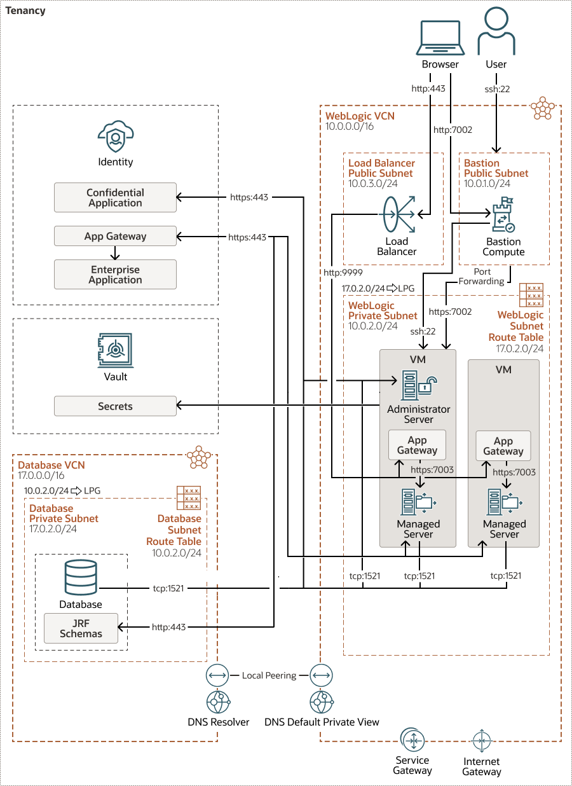

## WebLogic JRF domain with OCI DB

This solution creates single/multi node Weblogic cluster with OCI Database and Oracle Identity Cloud Service fronted by
a load balancer.

This topology uses existing infrastructure.
- Existing VCN and existing subnets with private WebLogic subnet.
- OCI DB in a different VCN
- Existing public load balancer

Oracle Identity Cloud Service (IDCS) is used to authenticate user.



The above diagram shows a topology that includes most of the components supported by the Terraform scripts. 
In this scenario, the WebLogic servers are in a private subnet. To access the applications running on WebLogic, an existing
OCI load balancer in public regional subnet is used. A bastion instance with a public IP address is provisioned to allow
access to the VMs in the private subnet. The Oracle WebLogic Server domain is configured to use Oracle Identity Cloud Service
for authentication.

The diagram shows the WebLogic domain using a database located in a different VCN, with VCN peering. Peering is necessary
because DB VCN is different from WebLogic VCN. Since existing VCNs are used here, VCNs for WebLogic Server compute instances
and the Oracle Cloud Infrastructure Application Database are peered manually before creating the stack for the WebLogic
domain. To peer the VCNs manually, see [Manual VCN Peering](https://docs.oracle.com/en/cloud/paas/weblogic-cloud/user/configure-database-parameters.html#GUID-6A39A2A7-EF6C-408E-B5C7-C44089A9B134__MANUAL_VCN_PEERING).

## Before You Begin with OCI Terraform stack for WebLogic Server
Refer to the [documentation](https://docs.oracle.com/en/cloud/paas/weblogic-cloud/user/you-begin-oracle-weblogic-cloud.html)
for the pre-requisite steps to use the OCI Terraform stack for WebLogic Server.

## Workspace Checkout
- Install the latest version of git from http://git-scm.com/downloads
- For Linux and Mac: Add git to the PATH
- Clone the code using the command:

```bash
git clone https://github.com/oracle-quickstart/oci-weblogic-server.git
```

## Organization
The directory oci-weblogic-server/solutions/jrf consists of the following terraform files:

- jrf_instance.tfvars - WebLogic instance, bastion instance and network configuration
- existing_lb.tfvars - Load balancer configuration
- oci_db.tfvars  - OCI Database configuration
- idcs.tfvars - IDCS configuration

The directory oci-weblogic-server/solutions/common consists of the following:
- tenancy.tfvars - tenancy configuration

The files in the oci-weblogic-server/inputs directory contain the values of the images for the different combinations of
WebLogic edition and pricing. In this solution, the file _mp_image_ee_byol.tfvars_ is used to create a WebLogic Enterprise
Edition, BYOL instance. Specify a different file to use a different edition and/or pricing. 

See the [License](/README.md#license) section for more information to help you decide which _mp_image_*.tfvars_ file to use.

## Using the Terraform command line tool
```bash
cd oci-weblogic-server/terraform
```

Initialize the terraform provider plugin
```bash
terraform init
```

Update the variable values in tfvars files under directories terraform/solutions/common and terraform/solutions/jrf according to the user specific values
Invoke apply passing all *.tfvars files as input
```bash
terraform apply -var-file=../solutions/common/tenancy.tfvars -var-file=inputs/mp_image_ee_byol.tfvars -var-file=../solutions/jrf/jrf_instance.tfvars -var-file=../solutions/jrf/existing_lb.tfvars -var-file=../solutions/jrf/idcs.tfvars var-file=../solutions/jrf/oci_db.tfvars
```

To destroy the infrastructure
```bash
terraform destroy var-file=../solutions/common/tenancy.tfvars -var-file=inputs/mp_image_ee_byol.tfvars -var-file=../solutions/jrf/jrf_instance.tfvars -var-file=../solutions/jrf/existing_lb.tfvars -var-file=../solutions/jrf/idcs.tfvars var-file=../solutions/jrf/oci_db.tfvars
```
**Important:** Refer to [documentation](https://docs.oracle.com/en/cloud/paas/weblogic-cloud/user/delete-domain.html) for
steps to perform before running *terraform destroy*.
