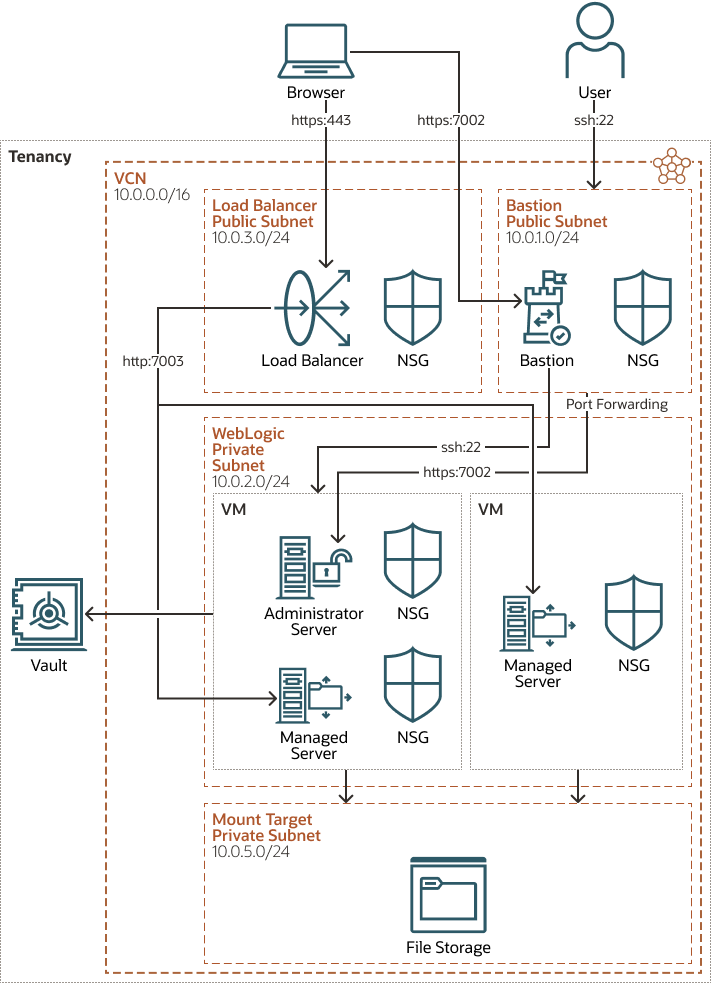

## WebLogic non JRF domain

This solution creates single/multi node WebLogic cluster with Oracle Cloud Infrastructure File Storage service (FSS) fronted
by a load balancer.

This topology creates WebLogic cluster in a private subnet. Following regional subnets are created under new virtual cloud
network (VCN).
- WebLogic regional private subnet
- Bastion regional public subnet
- Load balancer frontend public subnet
- Mount target regional private subnet



The above diagram shows a topology that includes most of the components supported by the Terraform scripts.
In this scenario, the WebLogic servers are created in a private subnet. To access the applications running on WebLogic,
a new OCI load balancer in public regional subnet will be created. A bastion instance with a public ip address is provisioned
to allow access to the WebLogic VMs in the private subnet. New file system (FSS) and mount target will be created in a
private subnet to support mounting shared storage for WebLogic instance data and middleware. The file system (FSS) will
be mounted on each WebLoogic instance at /u01/shared.

## Before You Begin with OCI Terraform stack for WebLogic Server
Refer to the [documentation](https://docs.oracle.com/en/cloud/paas/weblogic-cloud/user/you-begin-oracle-weblogic-cloud.html)
for the pre-requisite steps to use the OCI Terraform stack for WebLogic Server.

## Workspace Checkout
- Install the latest version of git from http://git-scm.com/downloads
- For Linux and Mac: Add git to the PATH
- Clone the code using the command:

```bash
git clone https://github.com/oracle-quickstart/oci-weblogic-server.git
```

## Organization
The directory oci-weblogic-server/solutions/non_jrf consists of the following terraform files:

- nonjrf_instance.tfvars - WebLoogic instance, bastion instance , and network configuration
- lb.tfvars - load balancer configuration
- fss.tfvars - file system configuration

The directory oci-weblogic-server/solutions/common consists of the following:
- tenancy.tfvars - tenancy configuration

The files in the oci-weblogic-server/images directory contain the values of the images for the different combinations of
WebLogic edition and pricing. In this solution, the file _mp_image_ee_byol.tfvars_ is used to create a WebLogic Enterprise
Edition, BYOL instance. Specify a different file to use a different edition and/or pricing. See the
[License section](#license) for more information.

## Using the terraform command line tool
```bash
cd oci-weblogic-server/terraform
```

Initialize the terraform provider plugin
```bash
terraform init
```

Update the variable values in tfvars files under directories terraform/solutions/common and terraform/solutions/non_jrf
according to the user specific values.
Invoke apply passing all *.tfvars files as input
```bash
terraform apply -var-file=../solutions/common/tenancy.tfvars -var-file=images/mp_image_ee_byol.tfvars -var-file=../solutions/non_jrf/nonjrf_instance.tfvars -var-file=../solutions/non_jrf /lb.tfvars -var-file=../solutions/non_jrf/fss.tfvars
```

To destroy the infrastructure
```bash
terraform destroy -var-file=../solutions/common/tenancy.tfvars -var-file=../solutions/common/mp_byol.tfvars -var-file=../solutions/non_jrf/nonjrf_instance.tfvars -var-file=../solutions/non_jrf/lb.tfvars -var-file=../solutions/non_jrf/fss.tfvars
```